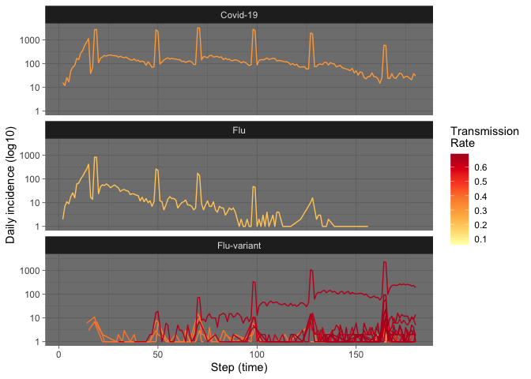
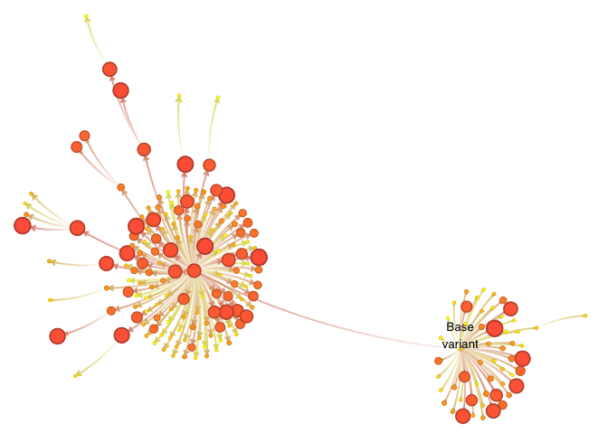

# epiworld(C++ \| R \| Py): A fast multi-language library for
epidemiological agent-based models


## From the abstract

I n this presentation, we will describe the main software design
components that make epiworld so flexible and fast, discuss the
challenges and decisions behind some of its key components, and provide
an extended example illustrating its use. We will show how epiworld can
be used to build a complex outbreak model with a large networked
population featuring an evolving virus that generates multiple variants,
heterogeneous susceptibility and recovery rates across the population,
and a dynamic non-pharmaceutical intervention that triggers according to
the n

``` bash
./main.o
```

    _________________________________________________________________________
    Running the model...
    ||||||||||||||||||||||||||||||||||||||||||||||||||||||||||||||||||||||||| done.
     done.
    ________________________________________________________________________________
    ________________________________________________________________________________
    SIMULATION STUDY

    Name of the model   : Susceptible-Exposed-Infected-Removed (SEIR) (connected)
    Population size     : 200000
    Agents' data        : (none)
    Number of entities  : 0
    Days (duration)     : 180 (of 180)
    Number of viruses   : 205
    Last run elapsed t  : 1.00s
    Last run speed      : 35.25 million agents x day / second
    Rewiring            : off

    Global events:
     - Update infected individuals (runs daily)
     - Full isolate (runs daily)

    Virus(es):
     - Covid-19
     - Flu
     ...and 203 more variants...

    Tool(s):
     - Vaccine

    Model parameters:
     - Avg. Incubation days : 7.0000
     - Contact rate         : 0.3000
     - Prob. Recovery       : 0.1429
     - Prob. Transmission   : 0.3000

    Distribution of the population at time 180:
      - (0) Susceptible : 199960 -> 128884
      - (1) Exposed     :     40 -> 1754
      - (2) Infected    :      0 -> 2261
      - (3) Recovered   :      0 -> 67101

    Transition Probabilities:
     - Susceptible  1.00  0.00  0.00  0.00
     - Exposed      0.00  0.84  0.16  0.00
     - Infected     0.00  0.00  0.80  0.20
     - Recovered    0.00  0.00  0.00  1.00

``` r
library(data.table)
incidence <- fread("res/transitions.tsv")
incidence <- incidence[from == "Susceptible" & to == "Exposed"]
library(ggplot2)
ggplot(incidence, aes(x = date, y = counts)) +
  geom_line() +
  labs(
    title = "Daily incidence",
    x = "Date",
    y = "Count"
    ) +
  scale_y_log10()
```

    Warning in scale_y_log10(): log-10 transformation introduced infinite values.


``` r
virus_hist <- fread("res/transmissions.tsv")

# Total transmissions
daily_virus <- virus_hist[, .(count = .N), by = .(virus, date)]
daily_virus[, t_rate := as.double(gsub(".+-0\\.", "0.", virus))]
```

    Warning in eval(jsub, SDenv, parent.frame()): NAs introduced by coercion

``` r
daily_virus[is.na(t_rate), t_rate := fifelse(
  virus == "Covid-19", .3, .2
)]

daily_virus[, vlabel := fifelse(grepl("-0\\.", virus), "Flu-variant", virus)]

ggplot(daily_virus, aes(
  x = date, y = count, color = t_rate, group=t_rate)) +
  scale_color_distiller(palette="YlOrRd", direction = 1) +
  geom_line() +
  scale_y_log10() +
  theme_dark() +
  facet_wrap(vars(vlabel), nrow = 3) +
  labs(
    color = "Transmission\nRate",
    shape = "Variant",
    x = "Step (time)",
    y = "Daily incidence (log10)"
  )
```



``` r
# Reading and preping the data
virus_info <- fread("res/virus_info.tsv")
virus_info[, t_rate := as.double(gsub(".+-0\\.", "0.", virus))]
```

    Warning in eval(jsub, SDenv, parent.frame()): NAs introduced by coercion

``` r
virus_info[is.na(t_rate), t_rate := fifelse(
  virus == "Covid-19", .3, .2
)]

virus_info[, label := fifelse(
  virus == "Flu",
  "Base\nvariant",
  ""
)]

# Generating edges
edges <- virus_info[, .(parent, virus_id)]
edges <- edges[ parent >= 0 ]

library(netplot)
```

    Loading required package: grid

``` r
library(igraph)
```


    Attaching package: 'igraph'

    The following object is masked from 'package:netplot':

        ego

    The following objects are masked from 'package:stats':

        decompose, spectrum

    The following object is masked from 'package:base':

        union

``` r
virus_net <- graph_from_data_frame(
  d = edges,
  vertices = virus_info[virus != "Covid-19"]
)


col <- grDevices::colorRamp(c("yellow", "tomato"))(
  V(virus_net)$t_rate / 0.7
) |> rgb(maxColorValue = 255)

set.seed(4341)
nplot(
  virus_net,
  vertex.size = ~ t_rate,
  vertex.color = col,
  vertex.label = V(virus_net)$label,
  edge.curvature = pi/8,
  edge.line.breaks = 20,
  vertex.nsides = 20,
  vertex.label.color = "black",
  vertex.label.show = 1,
  vertex.label.fontsize = 10,
  vertex.size.range = c(.005, .03, 4)
  )
```


